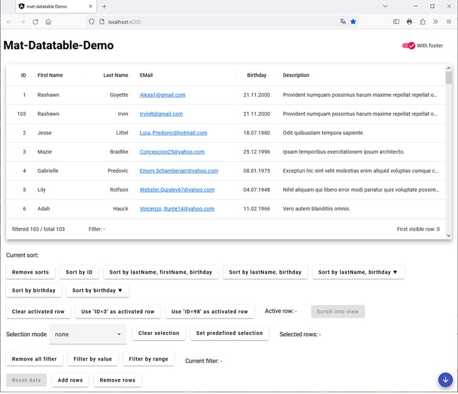

<a name="readme-top"></a>

# MatDatatable

A simple data table with virtual scrolling using Angular Material.


[]


<!-- TABLE OF CONTENTS -->
<details>
  <summary>Table of Contents</summary>
  <ol>
    <li>
      <a href="#about-the-project">About The Project</a>
      <ul>
        <li><a href="#built-with">Built With</a></li>
      </ul>
    </li>
    <li>
      <a href="#getting-started">Getting Started</a>
      <ul>
        <li><a href="#prerequisites">Prerequisites</a></li>
        <li><a href="#installation">Installation</a></li>
      </ul>
    </li>
    <li><a href="#usage">Usage</a></li>
    <li><a href="#roadmap">Roadmap</a></li>
    <li><a href="#contributing">Contributing</a></li>
    <li><a href="#license">License</a></li>
    <li><a href="#contact">Contact</a></li>
    <li><a href="#acknowledgments">Acknowledgments</a></li>
  </ol>
</details>

<!-- ABOUT THE PROJECT -->
## About The Project



This project creates a angular material table to be used as a replacement of ngx-datatable in one of my projects, as that project is still on angular v12 and an update to angular 15 is not in sight.

Only a minimal set of the functionality of ngx-datatable is implemented.

The table implements virtual scrolling.

The component is based on Angular Material and uses [Google Fonts](https://fonts.google.com/specimen/Roboto) and [Google Material Icons](https://google.github.io/material-design-icons/#icon-font-for-the-web).
Bith fonts are part of the project and not fetched via https.

<p align="right">(<a href="#readme-top">back to top</a>)</p>

<!-- GETTING STARTED -->
## Getting Started

To use this package in your project just follow these simple steps.

### Prerequisites

The package can be used in Angular apps with Angular Material installed.

This Version requires Angular 15.

### Installation

Install the package from npmjs
   ```sh
   npm install @bepo65/mat-datatable
   ```

<p align="right">(<a href="#readme-top">back to top</a>)</p>

<!-- API -->
## API reference

TODO add the api documentation here.

<p align="right">(<a href="#readme-top">back to top</a>)</p>

<!-- ROADMAP -->
## Roadmap

- [ ] Create table component
    - [ ] Add angular library
    - [ ] Add harness for library testing
    - [ ] Add cypress component test
- [ ] Add demo project
    - [ ] Add angular application
    - [ ] Add cypress end--to-end test

See the [open issues](https://github.com/bepo65mat-datatable/repo_name/issues) for a full list of proposed features (and known issues).

<p align="right">(<a href="#readme-top">back to top</a>)</p>

<!-- CONTRIBUTING -->
## Contributing

Contributions are what make the open source community such an amazing place to learn, inspire, and create. Any contributions you make are **greatly appreciated**.

If you have a suggestion that would make this better, please fork the repo and create a pull request. You can also simply open an issue with the tag "enhancement".
Don't forget to give the project a star! Thanks again!

1. Fork the Project
2. Create your Feature Branch (`git checkout -b feature/AmazingFeature`)
3. Commit your Changes (`git commit -m 'Add some AmazingFeature'`)
4. Push to the Branch (`git push origin feature/AmazingFeature`)
5. Open a Pull Request

### Changelog
The project uses 'standard-version' to create the changelog. To enable this system, commit messages are linted before commits are executed by git.

To enable this system you have to run the following scripts in your local repository home directory:
```
npx husky install
npx husky add .husky/commit-msg "npx --no -- commitlint --edit $1"
```

**The structure of commit messages is**:
```
  <header>
  <BLANK LINE>
  <body>
  <BLANK LINE>
  <footer>
```

**header**
```
  <type>(<scope>): <short summary>
```
  
type and scope
  - build: Changes that affect the build system or external dependencies (example scope: npm)
  - docs: Documentation only changes
  - feat: A new feature
  - fix: A bug fix
  - perf: A code change that improves performance
  - refactor: A code change that neither fixes a bug nor adds a feature
  - test: Adding missing tests or correcting existing tests (example scopes: demo, lib, e2e)

**footer**
```
  BREAKING CHANGE: ... (requires MAJOR in Semantic Versioning)
```

For details of the commit messages format see [Contributing to Angular](https://github.com/angular/angular/blob/master/CONTRIBUTING.md#commit).


<p align="right">(<a href="#readme-top">back to top</a>)</p>

<!-- LICENSE -->
## License

Distributed under the MIT License. See `LICENSE` for more information.

<p align="right">(<a href="#readme-top">back to top</a>)</p>
