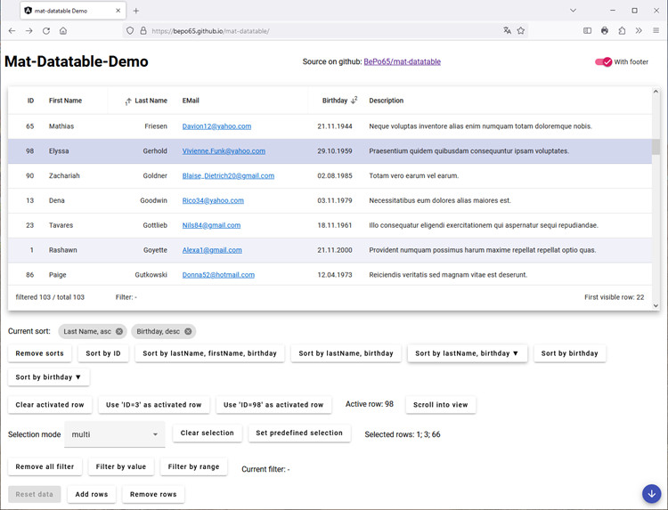

<a name="top"></a>

# Mat-Datatable

A simple data table with virtual scrolling using Angular Material.


[]


<!-- TABLE OF CONTENTS -->
<details>
  <summary>Table of Contents</summary>
  <ol>
    <li>
      <a href="#about-the-project">About The Project</a>
    </li>
    <li>
      <a href="#getting-started">Getting Started</a>
      <ul>
        <li><a href="#prerequisites">Prerequisites</a></li>
        <li><a href="#installation">Installation</a></li>
        <li><a href="#embed-mat-datatable-in-your-project">Embed Mat-Datatable In Your Project</a></li>
      </ul>
    </li>
    <li><a href="#used-assets">Used Assets</a></li>
    <li><a href="#mat-datatable-demo">Mat-Datatable Demo</a></li>
    <li>
      <a href="#api-reference">API Reference</a>
      <ul>
        <li><a href="#classes-api">Classes</a></li>
        <li><a href="#interfaces-api">Interfaces</a></li>
        <li><a href="#type-aliases-api">Type Aliases</a></li>
      </ul>
    </li>
    <li>
      <a href="#api-testing-harnesses">API Testing Harnesses</a>
      <ul>
        <li><a href="#classes-api-testing">Classes</a></li>
        <li><a href="#interfaces-api-testing">Interfaces</a></li>
      </ul>
    </li>
    <li><a href="#roadmap">Roadmap</a></li>
    <li><a href="#hints-on-possible-extensions">Hints On Possible Extensions</a></li>
    <li>
      <a href="#contributing">Contributing</a>
      <ul>
        <li><a href="#changelog">Changelog</a></li>
      </ul>
    </li>
    <li><a href="#license">License</a></li>
  </ol>
</details>

<!-- ABOUT THE PROJECT -->
## About The Project

This project extends 'angular material table' so that it can be used as a replacement for [ngx-datatable](https://github.com/swimlane/ngx-datatable) in one of my projects. Unluckily ngx-datatable seems to be dead as it is still on angular v12 and an update to a more recent angular version is not in sight.

Nat-Datatable implements a table with virtual scrolling, sorting and filtering. Only a minimal set of the functionality of ngx-datatable is implemented.



Try out the [live demo](https://bepo65.github.io/mat-datatable/).

<p align="right">(<a href="#top">back to top</a>)</p>

<!-- GETTING STARTED -->
## Getting Started

To use this package in your project just follow these simple steps.

### Prerequisites

The package can be used in Angular apps with Angular Material installed.

### Installation

Install the package from npmjs
   ```sh
   npm install @bepo65/mat-datatable
   ```

### Embed Mat-Datatable In Your Project

Configure your angular application module (e.g: app.module.ts):
```ts
...
import { MatDatatableModule } from 'mat-datatable';

@NgModule({
  ...
  imports: [
    ...
    MatDatatableModule
  ]
})
```

Add Mat-Datatable to your html file (e.g: app.component.html):
```html
<div class="content-table">
  <mat-datatable #datatable
    [columnDefinitions]="columnDefinitions"
    [displayedColumns]="displayedColumns"
    [dataStoreProvider]="dataStore"
    [trackBy]="trackBy">
    loading...
  </mat-datatable>
</div>
```

The height of the element containing the mat-datatable must be set explicitly (e.g: app.component.scss):
```css
.content-table {
  height: 400px;
  margin: 0 1em;
  overflow: auto;
}
```

Some properties of mat-datatable must be configured in the component class (e,g, app.component.ts):
```ts
export class AppComponent {
  ...
    protected dataStore = new MyTableDataStore<MyTableItem>();
    protected columnDefinitions: MatColumnDefinition<MyTableItem>[] = [
      {
        columnId: 'id',
        header: 'ID',
        cell: (row: DemoTableItem) => row?.userId?.toString(),
        footer: 'id'
      },
      {
        columnId: 'name',
        sortable: true,
        resizable: true,
        header: 'Name',
        cell: (row: DemoTableItem) => row?.firstName,
        footer: 'name'
      }

    ];
    protected displayedColumns: string[] = ['id', 'name'];

```

<p align="right">(<a href="#top">back to top</a>)</p>

<!-- USED ASSETS -->
## Used Assets

The component is based on Angular Material and uses [Google Fonts](https://fonts.google.com/specimen/Roboto) and the [Google Material Icons](https://google.github.io/material-design-icons/#icon-font-for-the-web) font.
Both fonts are part of the project and not fetched via https.

<p align="right">(<a href="#top">back to top</a>)</p>

<!-- MAT-DATATABLE DEMO -->
## Mat-Datatable Demo

Demo project to show all features of Mat-Datatable.

```
git clone git@github.com:BePo65/mat-datatable.git
cd mat-datatable
npm start
```

Navigate to http://localhost:4200

<p align="right">(<a href="#top">back to top</a>)</p>

<!-- API REFERENCE -->
## API Reference

`import { MatDatatable } from '@bepo65/mat-datatable';`

<a id="classes-api"></a>

### Classes

#### **MatDatatable**

Component to create an angular material table based datatable.
The component is generic; the given type is used to define the object for the row data.

##### **Properties**

| Name | Description |
|------|-------------|
| `@Input() columnDefinitions: MatColumnDefinition<T>[]` | The definition of the columns used in the table. The order of the definitions needs not to correspond to the order of the columns in the table. Default value: `[]`. |
| | |

| Name | Description |
|------|-------------|
| `@Input() displayedColumns: string[]` | A list with the names of the columns in the table. The array contains the 'columnId' of the corresponding column definition. Default value: `[]`. |
| | |

| Name | Description |
|------|-------------|
| `@Input() rowSelectionMode: RowSelectionType` | The type of row selection. Default value: `'none'`. |
| | |

| Name | Description |
|------|-------------|
| `@Input() dataStoreProvider: DataStoreProvider<T>` | An object that connects the mat-datatable with the data source. The object must be the instance of a class implementing the DataStoreProvider interface. Default value: `new EmptyDataStoreProvider<T>`. |
| | |

| Name | Description |
|------|-------------|
| `@Input() trackBy(): TrackByFunction<T>` | A function that returns a value that identifies a single row. Default value: `(index: number, item: T) => JSON.stringify(item)`. |
| | |

| Name | Description |
|------|-------------|
| withFooter: boolean | Whether the table has a footer row. Default value: `true`. |
| | |

| Name | Description |
|------|-------------|
| `@Output() rowClick: EventEmitter<T>` | Emitted when a row is clicked. |
| | |

| Name | Description |
|------|-------------|
| @Output() rowSelectionChange: EventEmitter<T[]> | Emitted when the list of selected rows changes. |
| | |

| Name | Description |
|------|-------------|
| `@Output() sortChange: EventEmitter<MatSortDefinition[]>` | Emitted when the sort definition changes. |
| | |

| Name | Description |
|------|-------------|
| `firstVisibleIndexChanged: Observable<number>` | Emitted when the index of the first visible row changes. |
| | |

| Name | Description |
|------|-------------|
| `totalRowsChanged: Observable<number>` | Emitted when the total number of rows in the datastore changes (does not depend on any active filter). |
| | |

| Name | Description |
|------|-------------|
| `filteredRowsChanged: Observable<number>` | Emitted when the number of filtered rows changes. |
| | |

| Name | Description |
|------|-------------|
| `activatedRow: T \| undefined` | Marks a row as 'active'. |
| | |

| Name | Description |
|------|-------------|
| `selectedRows: T[]` | Marks rows as 'selected'. |
| | |

| Name | Description |
|------|-------------|
| `sortDefinitions: MatSortDefinition[]` | Gets / sets the current sort definition. |
| | |

| Name | Description |
|------|-------------|
| `filterDefinitions: FieldFilterDefinition\<T>[]` | Gets / sets the current filter definition. |
| | |

##### **Methods**

| | |
|------|-------------|
| `scrollToRow` | Scrolls to the given row. |
| **Parameters** |
| row: T | Row to show on the top of the current viewport. |
| | |

| | |
|------|-------------|
| `reloadTable` | Reloads the rows of the table. |
| | |

<a id="interfaces-api"></a>

### Interfaces

#### DataStoreProvider

Component to create an angular material table based datatable.
The component is generic; the given type is used to define the object for the row data.

##### **Methods**

| | |
|------|-------------|
| `getPagedData` | Fetches data from the datastore respecting sorting and filtering. |
| **Parameters** |
| rowsRange: RequestRowsRange | The range of rows to fetch. |
| sorts: FieldSortDefinition<T>[] | The sort definitions to use. |
| filters: FieldFilterDefinition<T>[] | The filter definitions to use. |
| **Returns** |
| Observable<Page<T>> | Emitting fetched data from the datastore. |
| | |

#### MatColumnDefinition

Interface for the definition of a single table column.

##### **Properties**

| Name | Description |
|------|-------------|
| `columnId: string` | The ID of the column. |
| `sortable: boolean` | Whether this column can be used for sorting. By default a column is not sortable. |
| `resizable: boolean` | Whether this column can be resized. By default a column is not resizable. |
| `header: string` | The text in the header row of a column. |
| `headerAlignment: ColumnAlignmentType` | The alignment of the header row of a column. |
| `cell: (element: TRowData) => string` | The function to get the content of a cell. |
| `cellAlignment: ColumnAlignmentType` | The alignment of a data row in a column. |
| `width: string` | The width of the column. |
| `tooltip: (element: TRowData) => string` | The function to get the tooltip for a cell. |
| `showAsMailtoLink: boolean` | Whether this cell should be shown a 'mailto' link. By default a column is not shown as mailto link. |
| `showAsSingleLine: boolean` | Whether this cell should be truncated to a single line. By default multiline text in a column is not shown as a single line. |
| `footer: string` | The text in the footer row of a column. |
| `footerAlignment: ColumnAlignmentType` | The alignment of the footer row of a column. |
| `footerColumnSpan: number` | The number of columns a footer should span. By default a footer spans 1 column. |
| | |

#### MatSortDefinition

Interface for the definition of the sorting of 1 table column.

##### **Properties**

| Name | Description |
|------|-------------|
| `columnId: string` | The 'columnId' of the column to use for sorting. |
| `direction: SortDirection` | The direction used to sort the column. |
| | |

#### Page

Interface defining the properties of a requests for a range of rows.

##### **Properties**

| Name | Description |
|------|-------------|
| `startRowIndex: number` | The index of the first row to return. |
| `numberOfRows: number` | The number of rows to return. |
| | |

#### RequestRowsRange

Interface defining the properties of a page of rows returned from the datastore.

##### **Properties**

| Name | Description |
|------|-------------|
| `content:T[]` | The array of the requested rows. |
| `startRowIndex` | The index of the first row returned. |
| `returnedElements` | The number of rows in 'content'. |
| `totalElements` | The number of rows in the unfiltered data store. |
| `totalFilteredElements` | The number of rows after filtering. |
| | |

<a id="type-aliases-api"></a>

### Type Aliases

#### ColumnAlignmentType

The alignment of the content of a column

| |
|------|
| type ColumnAlignmentType = "left" | "center" | "right"; |
| |

#### FieldFilterDefinition

The definition of a parameter filtering for the column identified by the given 'fieldName'.

| |
|------|
| type FieldFilterDefinition<T> = StrictUnion\<(FieldFilterDefinitionSimple\<T> \| FieldFilterDefinitionRange\<T>)>; |
| |

#### FieldFilterDefinitionRange

The definition of a parameter filtering for a range of values.

| |
|------|
| type FieldFilterDefinitionSimple<T> = {<br>&nbsp;&nbsp;fieldName: keyof T<br>&nbsp;&nbsp;valueFrom: string \| number \| Date<br>&nbsp;&nbsp;valueTo: string \| number \| Date<br>}; |
| |

#### FieldFilterDefinitionSimple

The definition of a parameter filtering for a single value.

| |
|------|
| type FieldFilterDefinitionSimple<T> = {<br>&nbsp;&nbsp;fieldName: keyof T<br>&nbsp;&nbsp;value: string \| number \| Date<br>}; |
| |

#### FieldSortDefinition

The definition of a single sort parameter.

| |
|------|
| type FieldSortDefinition<T> = {<br>&nbsp;&nbsp;fieldName: keyof T<br>&nbsp;&nbsp;sortDirection: SortDirectionAscDesc<br>}; |
| |

#### RowSelectionType

How many rows can be selected.

| |
|------|
| type RowSelectionType = 'none' \| 'single' \| 'multi'; |
| |

#### SortDirectionAscDesc

The direction of a sort.

| |
|------|
| type SortDirection = 'asc' \| 'desc'; |
| |

<!-- API TESTING REFERENCE -->
## API Testing Harnesses

`import { MatDatatableHarness } from '@bepo65/mat-datatable/testing';`

<a id="classes-api-testing"></a>

### Classes

<a id="_matrowcellharnessbase"></a>

#### **_MatRowCellHarnessBase** extends [ContentContainerComponentHarness\<string>](https://material.angular.io/cdk/test-harnesses/api#ContentContainerComponentHarness)

##### **Methods**

| | |
|------|-------------|
| `static async booleanMatches` | Checks if the specified nullable boolean value matches the given value. |
| **Parameters**|
| value: boolean \| null \| Promise\<boolean \| null> | The nullable boolean value to check, or a Promise resolving to the nullable boolean value. |
| pattern: boolean \| null | The boolean the value is expected to match. If 'pattern' is 'null', the value is expected to be 'null'. |
| **Returns** |
| Promise\<boolean> | Whether the value matches the pattern. |
| | |

| | |
|------|-------------|
| `async getColumnName` | Gets the name of the column that the cell belongs to. |
| **Returns** |
| Promise\<string> | The name of the column that the cell belongs to. |
| | |

| | |
|------|-------------|
| `async getColumnWidth` | Gets the cell's width in 'px' (with padding). |
| **Returns** |
| Promise\<number> | The cell's width. |
| | |

| | |
|------|-------------|
| `async getText` | Gets the cell's text. |
| **Returns** |
| Promise\<string> | The cell's text. |
| | |

<a id="_matrowharnessbase"></a>

#### **_MatRowHarnessBase** extends [ComponentHarness](https://material.angular.io/cdk/test-harnesses/api#ComponentHarness)

Abstract class used as base for harnesses that interact with a mat-datatable row.

##### **Methods**

| | |
|------|-------------|
| `async getCells` | Gets a list of 'MatRowCellHarness', 'MatHeaderCellHarness' or 'MatFooterCellHarness' for all cells in the row. |
| filter: CellHarnessFilters = {} | A set of criteria that can be used to filter a list of cell harness instances. |
  **Returns** |
| Promise\<Cell[]> | A filtered list of MatRowCellHarness for the cells in the row. |
| | |

| | |
|------|-------------|
| `async getCellTextByColumnName` | Gets the text inside the row organized by columns. |
  **Returns** |
| Promise\<MatRowHarnessColumnsText> | The text inside the row organized by columns. |
| | |

| | |
|------|-------------|
| `async getCellTextByIndex` | Gets the text of the cells in the row. |
| **Parameters**|
| filter: CellHarnessFilters = {} | A set of criteria that can be used to filter a list of cell harness instances. |
| **Returns** |
| Promise\<string[]> | The text of the cells in the row. |
| | |

| | |
|------|-------------|
| `static async rowCellsContentMatch` | Checks if the values of the table row columns given in the 'value' parameter, match the given column values. Only columns defined in the pattern are inspected. |
| **Parameters**|
| value: MatRowHarnessColumnsText \| Promise<MatRowHarnessColumnsText> \| null | The nullable object defining all columns of a row and their values used for the checks. Alternatively a Promise resolving to the nullable object. |
| pattern: Record<string, string \| RegExp> \| null | Object defining the columns and the values or RegExp expected to match. If 'pattern' is 'null', the value is expected to be 'null'. |
| **Returns** |
| Promise\<boolean> | Whether the value matches the pattern. |
| | |

<a id="matdatatableharness"></a>

#### **MatDatatableHarness** extends [ContentContainerComponentHarness\<string>](https://material.angular.io/cdk/test-harnesses/api#ContentContainerComponentHarness)

Harness for interacting with a mat-datatable in tests.

##### **Properties**

| Name | Description |
|------|-------------|
| `static hostSelector: '.mat-datatable'` | The selector for the host element of a 'MatDatatableHarness'. |
| | |

##### **Methods**

| | |
|------|-------------|
| `async getAllChildLoaders` | Gets an array of HarnessLoader instances. |
| **Parameters** |
| selector: string | A string used for selecting the instances. |
| **Returns** |
| Promise\<HarnessLoader[]> | An array of HarnessLoader instances. |
| | |

| | |
|------|-------------|
| `async getAllHarnesses` | Gets an array of harness instances. |
| **Parameters** |
| query: HarnessQuery<T> | A query for a ComponentHarness used to filter the instances, which is expressed as either a ComponentHarnessConstructor or a HarnessPredicate. |
| **Returns** |
| Promise\<T[]> | An array of harness instances. |
| | |

| | |
|------|-------------|
| `async getCellTextByColumnName` | Gets the text inside the entire table organized by columns. |
| **Returns** |
| Promise\<MatDatatableHarnessColumnsText> | The text inside the entire table organized by columns. |
| | |

| | |
|------|-------------|
| `async getCellTextByIndex` | Gets the text inside the entire table organized by rows. |
| **Returns** |
| Promise\<string[][]> | Array for all rows containing the content of a row as an array. |
| | |

| | |
|------|-------------|
| `async getChildLoader`| Searches for an element matching the given selector below the root element of this HarnessLoader. |
| **Parameters** |
| selector: string | A string used for selecting the HarnessLoader. |
| **Returns** |
| Promise\<HarnessLoader> | A new HarnessLoader rooted at the first matching element. |
| | |

| | |
|------|-------------|
| `async getFooterRows` | Gets a list of the footer rows in a mat-datatable. |
| **Returns** |
| Promise\<MatHeaderRowHarness[]> | A list of the footer rows. |
| | |

| | |
|------|-------------|
| `async getHarness` | Searches for an instance of the given ComponentHarness class or HarnessPredicate below the root element of this HarnessLoader. |
| **Parameters** |
| query: HarnessQuery<T> | A query for a ComponentHarness used to filter the instances, which is expressed as either a ComponentHarnessConstructor or a HarnessPredicate. |
| **Returns** |
| Promise\<T> | An instance of the harness corresponding to the first matching element. |
| | |

| | |
|------|-------------|
| `async getHarnessOrNull` | Gets an instance of the given ComponentHarness class or HarnessPredicate below the root element of this HarnessLoader. |
| **Parameters** |
| query HarnessQuery<T> | A query for a ComponentHarness used to filter the instances, which is expressed as either a ComponentHarnessConstructor or a HarnessPredicate. |
| **Returns** |
| Promise\<T \| null> | An instance of the harness corresponding to the first matching element. |
| | |

| | |
|------|-------------|
| `async getHeaderRows` | Gets a list of the header rows in a mat-datatable. |
| **Returns** |
| Promise\<MatHeaderRowHarness[]> | A list of the header rows. |
| | |

| | |
|------|-------------|
| `async getRows` | Gets a list of the regular data rows in a mat-datatable. |
| **Parameters** |
| filter: RowHarnessFilters = {} | A set of criteria that can be used to filter a list of row harness instances. |
| **Returns** |
| Promise\<MatRowHarness[]> | A filtered list of the regular data rows. |
| | |

| | |
|------|-------------|
| `async hasHarness` | Check, if the harness contains the instances defined by 'query'. |
| **Parameters** |
| query HarnessQuery<T> | A query for a ComponentHarness used to filter the instances, which is expressed as either a ComponentHarnessConstructor or a HarnessPredicate. |
| **Returns** |
| Promise\<boolean> | 'True', if the instances is part of the harness. |
| | |

| | |
|------|-------------|
| `async host` | Gets a Promise for the 'TestElement' representing the host element of the component. |
| **Returns** |
| Promise\<TestElement> | The 'TestElement' representing the host element of the component. |
| | |

| | |
|------|-------------|
| `static with` | Gets a 'HarnessPredicate' that can be used to search for a mat-datatable with specific attributes. |
| **Parameters** |
| options: TableHarnessFilters = {} | Options for narrowing the search. |
| **Returns** |
| HarnessPredicate<T> | A 'HarnessPredicate' configured with the given options. |
| | |

<a id="matfootercellharness"></a>

#### **MatFooterCellHarness** extends [_MatRowCellHarnessBase](#MatRowCellHarnessBase)

Harness for interacting with an MDC-based Angular Material table footer cell.

##### **Properties**

| | |
|------|-------------|
| `static hostSelector: '.mat-mdc-footer-cell'` | The selector for the host element of a 'MatFooterCellHarness' instance. |

<a id="matfooterrowharness"></a>

#### **MatFooterRowHarness** extends [_MatRowHarnessBase](#MatRowHarnessBase)

Harness for interacting with a mat-datatable footer row.

##### Properties

| | |
|------|-------------|
| `static hostSelector: '.mat-mdc-footer-row'` | Used to identify the host element of a 'MatFooterRowHarness' instance. |
| | |

<a id="matheadercellharness"></a>

#### **MatHeaderCellHarness** extends [_MatRowCellHarnessBase](#MatRowCellHarnessBase)

Harness for interacting with an MDC-based Angular Material table header cell.

##### **Properties**

| | |
|------|-------------|
| `static hostSelector: '.mat-mdc-header-cell'` | The selector for the host element of a 'MatHeaderCellHarness' instance. |

##### **Methods**

| | |
|------|-------------|
| `async getText` | Gets the header cell's text. |
| **Return** |
| Promise\<string> | The header cell's text. |
| | |

| | |
|------|-------------|
| `async isResizable` | Check, if the cell is defined as 'resizable'. |
| **Returns** |
| Promise\<boolean> | The cell is resizable. |
| | |

| | |
|------|-------------|
| `async resize` | Resize the cell to a new width (if 'resizable'). |
| **Parameters** |
| newWidth: number | The new width of the cell in 'px'. |
| **Returns** |
| Promise\<void> | The cell got resized. |
| | |

<a id="matheaderrowharness"></a>

#### **MatHeaderRowHarness** extends [_MatRowHarnessBase](#MatRowHarnessBase)

Harness for interacting with a mat-datatable header row.

##### Properties

| | |
|------|-------------|
| `static hostSelector: '.mat-mdc-header-row'` | Used to identify the host element of a 'MatHeaderRowHarness' instance. |
| | |

##### Methods

| | |
|------|-------------|
| `async getCells` | Gets a list of 'MatRowCellHarness' for all cells in the row. |
| **Parameters** |
| filter: HeaderCellHarnessFilters = {} | A set of criteria that can be used to filter a list of cell harness instances. |
| **Returns** |
| Promise\<MatHeaderCellHarness[]> | A filtered list of MatRowCellHarness for the cells in the header row. |
| | |

<a id="matmultisortharness"></a>

#### **MatMultiSortHarness** extends [ComponentHarness](https://material.angular.io/cdk/test-harnesses/api#ComponentHarness)

Harness for interacting with a mat-multi-sort element in tests.

##### **Properties**

| | |
|------|-------------|
| `static hostSelector: '.mat-multi-sort'` | Used to identify the elements in the DOM. |
| | |

##### **Methods**

| | |
|---|---|
| `async getActiveHeaders` | Gets all headers used for sorting in the 'mat-multi-sort'. |
| **Returns** |
| Promise\<MatMultiSortHeaderHarness[]> | All headers used for sorting. |
| | |

| | |
|---|---|
| `async getActiveSortData` | Gets the sorting data for all headers used for sorting in the 'mat-multi-sort'. |
| **Returns** |
| Promise\<DomSortingDefinition[]> | Sorting data of all headers used for sorting. |
| | |

| | |
|---|---|
| `async getSortHeaders` | Gets the headers used for sorting in the 'mat-multi-sort' reduced by the given 'filter'. |
| **Parameters** |
| filter: MultiSortHeaderHarnessFilters = {} | |
| **Returns** |
| Promise\<MatMultiSortHeaderHarness[]> | The filtered sort headers. |
| | |

| | |
|---|---|
| `async host` | Gets a Promise for the 'TestElement' representing the host element of the component. |
| **Returns** |
| Promise\<TestElement> | The 'TestElement' representing the host element of the component. |
| | |

| | |
|---|---|
| `static with` | Gets a 'HarnessPredicate' that can be used to search for a 'mat-multi-sort' with specific attributes. |
| **Parameters** |
| options: MultiSortHarnessFilters = {} | Options for narrowing the search. |
| **Returns** |
| HarnessPredicate\<MatMultiSortHarness> | A 'HarnessPredicate' configured with the given options. |
| | |

<a id="matmultisortheaderharness"></a>

#### **MatMultiSortHeaderHarness** extends [ComponentHarness](https://material.angular.io/cdk/test-harnesses/api#ComponentHarness)

Harness for interacting with a `mat-multi-sort header` element in tests.

##### **Properties**

| | |
|---|---|
| `static hostSelector` | Used to identify the elements in the DOM (value: '.mat-multi-sort-header'). |
| | |

##### **Methods**

| | |
|---|---|
| `async click` | Clicks the header to change its sorting direction. Only works if the header is enabled. |
| **Returns** |
| Promise\<void> | Promise that resolves when the click action completes. |
| | |

| | |
|---|---|
| `async getAllSortData` | Gets an object with the sorting data of the header. |
| **Returns** |
| Promise\<MatMultiSortHeaderHarnessSortDefinition> | The sorting data of the header. |
| | |

| | |
|---|---|
| `async getId` | Gets the id of the sort header. |
| **Returns** |
| Promise\<string> | The id of the sort header. |
| | |

| | |
|---|---|
| `async getLabel` | Gets the label of the sort header. |
| **Returns** |
| Promise\<string> | The label of the sort header. |
| | |

| | |
|---|---|
| `async getSortDirection` | Gets the sorting direction of the header. |
| **Returns** |
| Promise\<SortDirection> | The sorting direction of the header. |
| | |

| | |
|---|---|
| `async getSortPosition` | Gets the sorting position of the header. |
| **Returns** |
| Promise\<SortDirection> | The sorting position of the header (1..n). |
| | |

| | |
|---|---|
| `async host` | Gets a Promise for the 'TestElement' representing the host element of the component. |
| **Returns** |
| Promise<TestElement> | The 'Promise' for the 'TestElement'. |
| | |

| | |
|---|---|
| `async isActive` | Gets whether the sort header is currently being used for sorting. |
| **Returns** |
| Promise<boolean> | `True`, if the sort header is currently being used for sorting. |
| | |

| | |
|---|---|
| `async isDisabled` | Whether the sort header is disabled. |
| **Returns** |
| Promise<boolean> | `True`, if the sort header is disabled. |
| | |

| | |
|---|---|
| `static with` | Gets a 'HarnessPredicate' that can be used to search for a sort header with specific attributes. |
| **Parameters** |
| options: MultiSortHeaderHarnessFilters = {} | Options for narrowing the search. |
| **Returns** |
| HarnessPredicate\<MatMultiSortHeaderHarness> | A 'HarnessPredicate' configured with the given options. |
| | |

<a id="matrowcellharness"></a>

#### **MatRowCellHarness** extends [_MatRowCellHarnessBase](#MatRowCellHarnessBase)

Harness for interacting with a mat-datatable cell in a row.

##### **Properties**

| | |
|------|-------------|
| `static hostSelector: '.mat-mdc-cell'` | Used to identify the host element of a 'MatRowCellHarness' instance. |

##### **Methods**

| | |
|------|-------------|
| `async isSingleLine` | Check, if the cell is defined as 'showAsSingleLine'. |
| **Returns** |
| Promise\<boolean> | The cell is shown as single line. |
| | |

<a id="matrowharness"></a>

#### **MatRowHarness** extends [_MatRowHarnessBase](#MatRowHarnessBase)

Harness for interacting with a mat-datatable row.

##### **Properties**

| | |
|------|-------------|
| `static hostSelector: '.mat-mdc-row'` | Used to identify the elements in the DOM. |

##### **Methods**

| | |
|---|---|
| `async click` | Clicks the row (e.g. to select a row). |
| **Returns** |
| Promise\<void> | Promise that resolves when the click action completes. |
| | |

| | |
|------|-------------|
| `static with` | Gets a `HarnessPredicate` that can be used to search for a mat-datatable row with specific attributes. |
| **Parameters** |
| options: RowHarnessFilters = {} | Options for narrowing the search. |
| **Returns** |
| HarnessPredicate<T> | A 'HarnessPredicate' configured with the given options. |

<p align="right">(<a href="#top">back to top</a>)</p>

<a id="interfaces-api-testing"></a>

### **Interfaces**

#### **CellHarnessFilters**

A set of criteria that can be used to filter a list of cell harness instances.

##### **Properties**

| | |
|------|-------------|
| columnName: string \| RegExp | Only find instances whose column name matches the given value. |
| text: string \| RegExp | Only find instances whose text matches the given value. |
| | |

#### **DomSortingDefinition**

##### **Properties**

| | |
|---|---|
| `id: string` | ID of the header element. |
| `label: string` | Label of the header. |
| `sortDirection: SortDirection` | Sort direction of the header. |
| `sortPosition: number` | Sort position of the header (1..n). |
| | |

#### **MatDatatableHarnessColumnsText**

Text extracted from a table organized by columns.

This interface describes an object, whose keys are the names of the columns and whose values are an object with the following properties:

##### **Properties of a value**

| | |
|------|-------------|
| text: string[] | Array with content of the rows of this column. |
| headerText: string | Content of the header row of this column. |
| footerText: string \| undefined | Content of the footer row of this column. |
| | |

#### **MatDatatableHarnessFilters**

A set of criteria that can be used to filter a list of table harness instances.

##### **Properties**

| | |
|------|-------------|
| - | |
| | |

#### **MatRowHarnessColumnsText**

Text extracted from a table row organized by columns.

This interface describes an object, whose keys are the names of the columns and whose values are the corresponding cell content.

#### **MultiSortHarnessFilters**

##### **Properties**

| | |
|---|---|
| - | |
| | |

#### **MultiSortHeaderHarnessFilters**

##### **Properties**

| | |
|---|---|
| `label: string \| RegExp` | Label of the header. |
| `id: string \| RegExp` | ID of the header element. |
| `sortDirection: SortDirection` | Sort direction of the header. |
| `sortPosition: number` | Sort position of the header (1..n). |
| | |

#### **RowHarnessFilters**

A set of criteria that can be used to filter a list of row harness instances.

##### **Properties**

| | |
|------|-------------|
| - | |
| | |

<p align="right">(<a href="#top">back to top</a>)</p>

<!-- ROADMAP -->
## Roadmap

See the [open issues](https://github.com/BePo65/mat-datatable/issues) for a full list of proposed features (and known issues).

<p align="right">(<a href="#top">back to top</a>)</p>

<!-- HINTS ON POSSIBLE EXTENSIONS -->
## Hints On Possible Extensions

+ to make footer turn on / off dynamically it is not sufficient to wrap the footer cell and row definitions in ng-container. Details see [stackoverflow](https://stackoverflow.com/questions/63644938/angular-material-mat-table-dynamic-footer-header-rowdef/63648914#63648914). The demo uses [ngx-rerender](https://www.npmjs.com/package/ngx-rerender).

<p align="right">(<a href="#top">back to top</a>)</p>

<!-- CONTRIBUTING -->
## Contributing

Contributions are what make the open source community such an amazing place to learn, inspire, and create. Any contributions you make are **greatly appreciated**.

If you have a suggestion that would make this better, please fork the repo and create a pull request. You can also simply open an issue with the tag "enhancement".
Don't forget to give the project a star! Thanks again!

1. Fork the Project
2. Create your Feature Branch (`git checkout -b feature/AmazingFeature`)
3. Commit your Changes (`git commit -m 'Add some AmazingFeature'`)
4. Push to the Branch (`git push origin feature/AmazingFeature`)
5. Open a Pull Request

### Changelog
The project uses 'standard-version' to create the changelog. To enable this system, commit messages are linted before commits are executed by git.

To enable this system you have to run the following scripts in your local repository home directory:
```
npx husky install
npx husky add .husky/commit-msg "npx --no -- commitlint --edit $1"
```

**The structure of commit messages is**:
```
  <header>
  <BLANK LINE>
  <body>
  <BLANK LINE>
  <footer>
```

**header**
```
  <type>(<scope>): <short summary>
```
  
type and scope
  - build: Changes that affect the build system or external dependencies (example scope: npm)
  - docs: Documentation only changes
  - feat: A new feature
  - fix: A bug fix
  - perf: A code change that improves performance
  - refactor: A code change that neither fixes a bug nor adds a feature
  - test: Adding missing tests or correcting existing tests (example scopes: demo, lib, e2e)

**footer**
```
  BREAKING CHANGE: ... (requires MAJOR in Semantic Versioning)
```

For details of the commit messages format see [Contributing to Angular](https://github.com/angular/angular/blob/master/CONTRIBUTING.md#commit).


<p align="right">(<a href="#top">back to top</a>)</p>

<!-- LICENSE -->
## License

Distributed under the MIT License. See `LICENSE` for more information.

This project uses icons from the [Google Material Icons Library](https://developers.google.com/fonts/docs/material_icons) that are licensed under the [Apache License Version 2.0](https://www.apache.org/licenses/LICENSE-2.0.txt).

<p align="right">(<a href="#top">back to top</a>)</p>
